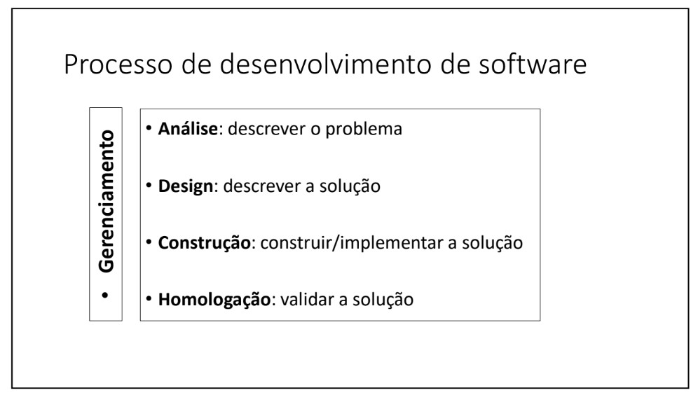
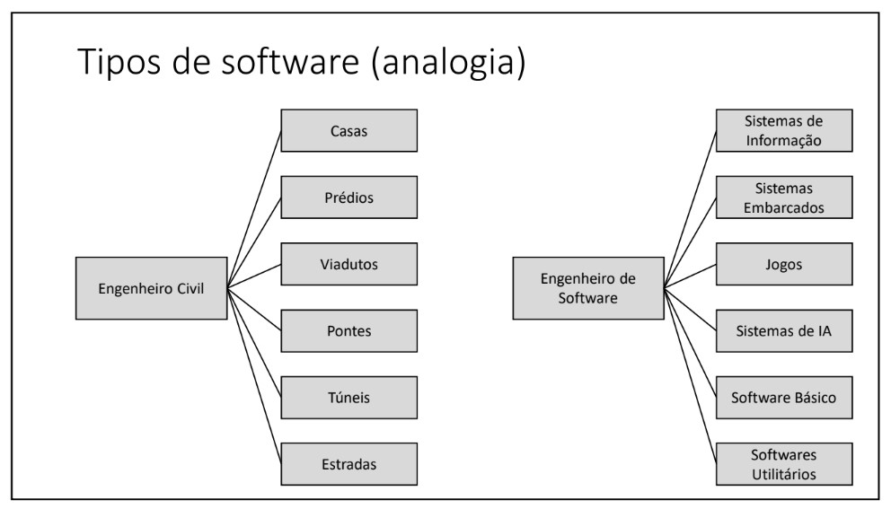
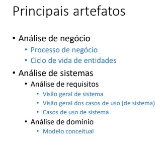
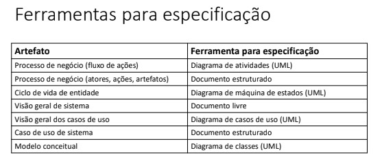

# Requirements Analysis

This is a summary of the training course of the Requirements Analysis

 - Module Focus:

    - Business Analysis
    - Requirements Analysis

## Business Analysis:

    - Understand and describe a company's processes.
    - Example: Life cycle of entities (e.g.: order or book status).

## Requirements Analysis:

    - Specify the system's functionalities.
    - Example: Use cases (user interaction with the system).

### Process to build a software:

  

- Comparison with Building Construction:

   - Stages: Analysis (understanding the problem), Design (solution design), Construction (implementation), Homologation (validation).

  

## Artefatos na Análise de Negócio:

- Documento de especificação do processo de negócio.
- Ciclo de vida de entidades.

## Artefatos na Análise de Sistemas:

  

### Análise de Requisitos:
- Visão geral do sistema (documento livre).
- Visão geral dos casos de uso (diagrama).
- Especificação dos casos de uso (documento estruturado).
  
### Análise de Domínio:
- Modelo conceitual (modelo de dados em nível de análise).

## Diferença entre Artefato e Ferramenta:

- Artefato: o que se quer especificar (ex: processo de negócio).
- Ferramenta: meio usado para especificar (ex: diagrama de atividades da UML).

### Exemplos de Ferramentas:

- Diagrama de atividades (UML) para especificar o fluxo de ações do processo de negócio.
- Diagrama de máquina de estados (UML) para o ciclo de vida de entidades.
- Diagrama de casos de uso (UML) para visão geral de casos de uso.
- Diagrama de classes (UML) para o modelo conceitual.

## Documentos Livres e Estruturados:

- Visão geral do sistema: documento livre.
- Especificação de casos de uso: documento estruturado.

## Importância de Diferenciar Artefato e Ferramenta:

- O artefato é o produto final (ex: processo de negócio).
- A ferramenta é apenas um meio para criar o artefato (ex: diagrama de atividades).

  

