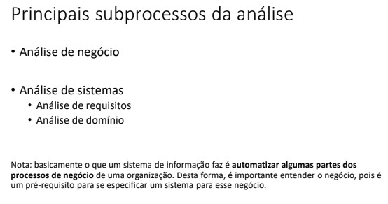
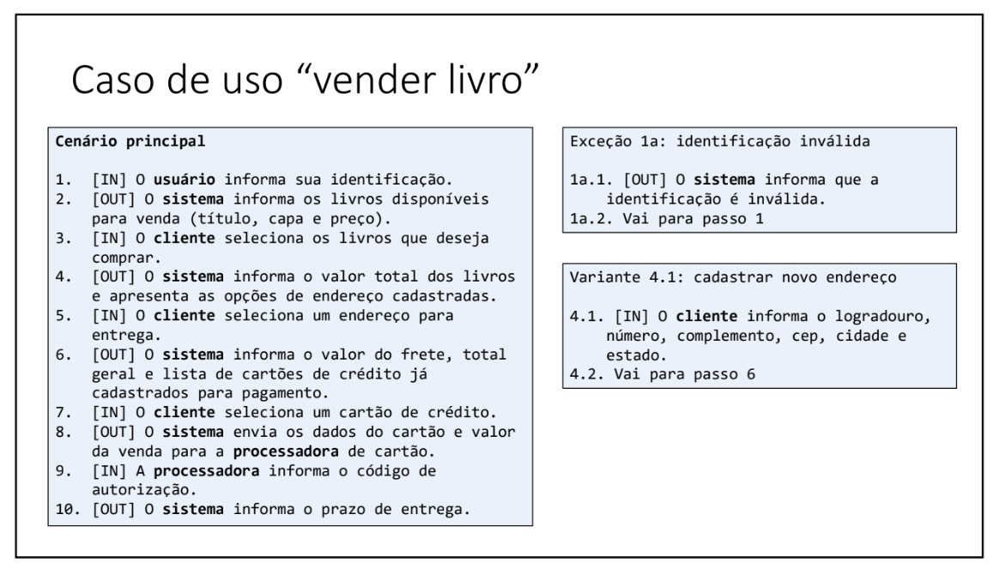

# Requirements Analysis

This is a summary of the training course of the Requirements Analysis

 - Module Focus:

    - Business Analysis
    - Requirements Analysis

## Business Analysis:

    - Understand and describe a company's processes.
    - Example: Life cycle of entities (e.g.: order or book status).

## Requirements Analysis:

    - Specify the system's functionalities.
    - Example: Use cases (user interaction with the system).

### Process to build a software:

  

#### The software development process involves disciplines and subprocesses, such as analysis, design, construction and validation.
- Analysis: Describes the problem.
- Design: Describes the solution.
- Construction: Implements the solution.
- Certification: Tests and validates the solution before delivery.
- The waterfall model follows a linear sequence, where each step is completed before moving on to the next.
- The waterfall model is best suited for areas such as civil engineering, but is not ideal for software development, which is more dynamic and cyclical.

  

- The unified process is a framework created by Booch, Rumbaugh and Jacobson, which organizes the disciplines in an iterative and incremental manner.
- The unified process divides development into phases: initiation, elaboration, construction and transition.
- The disciplines (business modeling, requirements, analysis, design, implementation, testing, etc.) are applied in different intensities throughout these phases.
- The unified process is iterative and incremental, meaning that disciplines are applied repeatedly in cycles, with continuous improvement.
- Variants of the unified process include the Rational Unified Process (RUP), OpenUP, and Agile Unified Process (AUP).
- Analysis is a subprocess that describes the problem and is part of an incremental process in software development.

  

- Comparison with Building Construction:

   - Stages: Analysis (understanding the problem), Design (solution design), Construction (implementation), Homologation (validation).

  

## Artifacts in Business Analysis:
- Business process specification document.
- Entity life cycle.

## Artifacts in Systems Analysis:

  

### Requirements Analysis:
- Overview of the system (free document).
- Overview of use cases (diagram).
- Specification of use cases (structured document).

### Domain Analysis:
- Conceptual model (data model at the analysis level).

## Difference between Artifact and Tool:
- Artifact: what you want to specify (e.g. business process).
- Tool: means used to specify (e.g. UML activity diagram).

### Examples of Tools:

- Activity diagram (UML) to specify the flow of actions of the business process.
- State machine diagram (UML) for the life cycle of entities.
- Use case diagram (UML) for an overview of use cases.
- Class diagram (UML) for the conceptual model.

## Free and Structured Documents:
- System overview: free document.
- Use case specification: structured document.

## Importance of Differentiating Artifact and Tool:
- The artifact is the final product (e.g., business process).
- The tool is just a means to create the artifact (e.g., activity diagram).

  

## Definition of Information System: 
- Organizational system used to collect, store and disseminate data.
- Used by companies and organizations to automate business processes.

## Characteristics of Information Systems: 
- Database with business information.
- Forms, reports and process automation (e.g.: purchases, inventory, employees).

## Information Systems Analysis Process: 
- Focused on systems for companies and organizations.
- Main subprocesses: 
    - Business Analysis: Understanding and describing the business, its rules and processes.
    - Systems Analysis: Understanding the needs and requirements to build the system.

  

## Subdivisions of Systems Analysis:
- Requirements Analysis: Identify what the system needs to do.
- Domain Analysis: Understand the context and environment of the system.

## Objective of Information Systems:
- Automate parts of business processes, making them more efficient.
- Example: Automate calculations and payroll generation in the financial sector.

## Importance of Business Analysis:
- Understanding the business is a prerequisite for specifying an appropriate system.
- Although it is not a systems analysis, business analysis is essential to the process.

  

# **Requirements Overview**

## **Definition of Requirements**
- A requirement is a condition or characteristic that the system must meet.
- The classification of requirements varies depending on authors and schools of thought.

  

## **Types of Requirements**

### 1. **Functional Requirements**
- Involve data manipulation (e.g., database operations, queries, saving, etc.).
- **Subcategories**:
    - **With User Interaction**:
        - **Use Cases**:
            - **CRUD**: Create, Retrieve, Update, Delete (registration screens).
            - **Reports**: Generate listings or reports based on input arguments.
            - **Business Processes**: Automation or semi-automation of business processes.
    - **Without User Interaction**:
        - **Batch Processing**: Scheduled tasks (e.g., nightly jobs).
        - **System Integrations**: Data manipulation and information exchange between systems.
        - **Internal Processing**: Internal operations without user interaction.

### 2. **Non-Functional Requirements**
- Do not involve data transformations.
- Also referred to as "quality requirements."
- **Examples**:
    - **Usability**: Intelligibility, ease of use.
    - **Reliability**: Fault tolerance (e.g., resuming processing after an internet outage).
- **Classifications**:
    - **Forbes Mais**.
    - **ISO 9126** (internal and external quality).
- **Observations**:
    - Classifications are not mutually exclusive (a requirement can belong to more than one category).
    - Requirements should be organized into topics in the document.

  

## **Final Considerations**
- Classifications serve as guidance and help organize the requirements document.

# **Understanding Use Scenarios and Use Cases**

## **Basic Concepts**
- **System Requirements**:
    - Divided into **functional** and **non-functional** requirements.
    - Use cases are part of **functional requirements**.
- **Usage**:
    - Interaction between **actors** and the **system**.
- **System Actors**:
    - Users who interact with the system (e.g., anonymous user, client, administrator, operator).
    - Interaction = **exchange of information** (inputs and outputs).

  

## **Use Scenario**
- **Definition**:
    - A **linear sequence** of interactions between actors and the system.
    - Does not include branches, conditions, or loops (e.g., "if", "else").
- **Example: Use Scenario "Sell Book"**:
    1. **Input**: User provides their identification (e.g., login).
    2. **Output**: System displays available books (title, cover, price).
    3. **Input**: Client selects the books they want to purchase.
    4. **Output**: System informs the total value and presents registered address options.
    5. **Input**: Client selects the delivery address.
    6. **Output**: System informs the shipping cost, total amount, and list of registered credit cards.
    7. **Input**: Client selects a credit card.
    8. **Output**: System sends the card details and purchase value to the payment processor.
    9. **Input**: Payment processor provides an authorization code.
    10. **Output**: System informs the delivery time.

  

## **Actors in the Scenario**
- **Anonymous User**: Before identification.
- **Client**: After identification.
- **Payment Processor**: Interacts with the system to process the payment.

## **Differentiation**
- **Use Scenario**:
    - A **linear sequence** of steps.
    - Does not include branches or error handling.
- **Use Case**:
    - Includes alternative scenarios, such as registering a new address or handling errors (to be covered later).

## **Conclusion**
- A **use scenario** is a **linear sequence of interactions** between actors and the system.
- **Use cases** are broader and include alternative scenarios.

# **Understanding Use Case Scenarios**

## **Definition of a Use Case**
- A use case is a set of interrelated usage scenarios aimed at a specific objective.
- It includes:
    - **Main Scenario**: The ideal flow where everything works as expected.
    - **Alternative Scenarios**: Different paths or exceptions that may occur.

## **Example of a Use Case**
- **Use Case: Selling a Book**
    - **Main Scenario**: A linear sequence of steps to sell a book.
    - **Alternative Scenarios**: Different paths or exceptions, such as invalid identification.

## **Components of a Use Case**
. **Main Scenario**:
- The ideal sequence of steps.
  . **Exception Scenarios**:
- Handle errors, such as invalid identification.
  . **Variant Scenarios**:
- User options, such as registering a new address.

## **Numbering Alternative Scenarios**
- Alternative scenarios are numbered based on the step in the main scenario that caused the deviation.
- Example:
    - **Exception 1A**: Occurs at step 1 of the main scenario.

## **Data Specificity**
- Each step must detail the required information (e.g., street, number, ZIP code).
- This helps developers create accurate screens and functionalities.

## **Use Case Utility**
. **Design**:
- Guides designers in defining operations and API endpoints.
  . **Implementation**:
- Helps developers ensure all requirements are met.
  . **Testing**:
- Assists analysts in designing tests aligned with the data and flows.

## **Use Case as a Contractual Tool**
- Demonstrates the complexity of the operation.
- Facilitates cost estimation and pricing for clients.

## **Complete Example**
- **Main Scenario**:
    - A detailed sequence of steps.
- **Exception Scenarios**:
    - Example: **Exception 1A** - Invalid identification.
        - Step 1A.1: The system informs the user that the identification is invalid.
        - Step 1A.2: The system requests the user to re-enter their identification.
- **Variant Scenarios**:
    - Example: **Variant 4.1** - Register a new address.
        - Step 4.1.1: The user provides street, number, complement, ZIP code, city, and state.
        - Step 4.1.2: The process returns to step 6.

## **Key Notes**
- Always specify the data required in each step.
- Ensure clarity for developers to implement the correct functionality.

# Documentation: Attributes of a Use Case

This document describes the main attributes of a use case, based on best practices for system modeling.

## Attributes of a Use Case

### 1. **Interactivity**
- A use case must involve **information exchange** between the system and the actors.
- Complementary steps can be included for better understanding, but the main focus should be on the exchange of information.

### 2. **Single Session**
- The use case must occur within a **single session of system use**.
- **Session**: the time interval during which the user is using the system.
- Example: the user starts an operation, performs the necessary actions, and finishes without interruptions.
- Complex operations that require more than one session should be divided into **multiple use cases**.

### 3. **Consistent Result**
- The system must start and finish the use case in a **consistent state**.
- There must be no pending operations or incomplete calculations at the end of the use case.
- Even in case of failure or abortion, the system must remain consistent.

## Examples of Use Cases
- **Making a purchase**: the user selects items, makes the payment, and completes the purchase in a single session.
- **Registering a payment**: the user enters payment details and confirms the operation, leaving the system in a consistent state.

---

## Conclusion

Following these attributes ensures that use cases are well-defined, promoting clarity and consistency in system development.

  

# Documentation: Use Case Diagram vs. Use Case Detailing

This document explains the key differences between a use case diagram and the detailing of use cases, based on best practices for system modeling.

## Key Differences

### 1. **Use Case Diagram**
- Provides a **high-level overview** of the system.
- Displays the **actors** and the **use cases**.
- Acts as a **panoramic view** of the system's use cases.

### 2. **Use Case Detailing**
- Contains the **true value** of the use case.
- Describes the **steps** and the **information exchanged** between the user and the system.
- Focuses on **best practices** and **techniques** to create effective use cases.

### 3. **Importance of Differentiation**
- It is crucial to understand that the diagram is only a high-level overview, while the detailing provides deeper and more practical insights.

## Next Steps
- Learn how to create use case diagrams to express the system's overall view.
- Study how to effectively detail use cases using best practices and techniques.

---

## Conclusion

Understanding the distinction between use case diagrams and their detailing ensures clarity in system modeling and helps in creating effective use cases.

  

